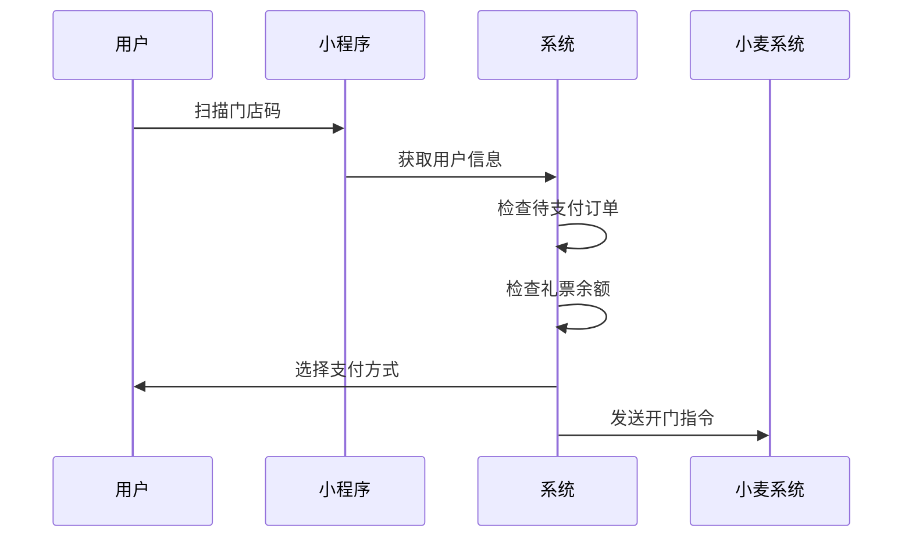

# 智能柜营运系统开发文档

## 一、项目概述

### 1.1 项目背景
开发一个营运系统用来对接小麦智能售货柜，包含管理后台和智能售货柜小程序两部分。

### 1.2 系统架构
```
营运系统
├── 管理后台（Web端）
│   ├── 用户管理模块
│   ├── 门店管理模块
│   ├── 设备管理模块
│   ├── 商品管理模块
│   ├── 订单管理模块
│   ├── 异常订单模块
│   ├── 投诉订单模块
│   └── 数据统计模块
└── 小程序端
    ├── 扫码开门模块
    ├── 订单模块
    └── 投诉模块
```

## 二、系统对接关系

### 2.1 外部系统对接
1. **小麦系统对接**
   - 设备管理接口
   - 开门控制接口
   - 订单推送接口
   - 异常订单推送接口

2. **ERP系统对接**
   - 商品信息同步接口
   - 销售数据推送接口

3. **微信支付对接**
   - 支付分授权
   - 支付接口
   - 退款接口

### 2.2 数据流转关系
```
ERP系统 -> 营运系统：商品基础信息
营运系统 -> 小麦系统：设备绑定、开门指令
小麦系统 -> 营运系统：订单数据、异常订单
营运系统 -> ERP系统：销售数据汇总
```

## 三、数据库设计

### 3.1 核心表结构
```sql
-- 用户表
CREATE TABLE users (
    id INT PRIMARY KEY,
    username VARCHAR(100),
    phone VARCHAR(20),
    ticket_balance INT,
    create_time DATETIME
);

-- 门店表
CREATE TABLE stores (
    id INT PRIMARY KEY,
    store_code VARCHAR(50),
    store_name VARCHAR(100),
    store_type ENUM('儿童','电玩','运动馆'),
    store_property ENUM('直营','加盟'),
    address VARCHAR(200),
    phone VARCHAR(20)
);

-- 设备表
CREATE TABLE devices (
    id INT PRIMARY KEY,
    device_code VARCHAR(50),
    store_id INT,
    online_status TINYINT,
    qr_code VARCHAR(200)
);

-- 订单表
CREATE TABLE orders (
    id INT PRIMARY KEY,
    order_no VARCHAR(50),
    device_id INT,
    user_phone VARCHAR(20),
    total_amount DECIMAL(10,2),
    payment_type ENUM('微信','礼票'),
    wx_payment_amount DECIMAL(10,2),
    ticket_payment_amount INT,
    store_id INT,
    order_time DATETIME,
    payment_time DATETIME,
    payment_status TINYINT,
    wheat_order_no VARCHAR(50),
    order_type ENUM('正常','已修正','补扣'),
    related_order_no VARCHAR(50)
);
```

## 四、核心业务流程

### 4.1 扫码开门流程


### 4.2 订单处理流程
1. **正常订单流程**
   - 用户关门后小麦推送订单
   - 系统生成订单记录
   - 根据支付方式扣款
   - 更新订单状态

2. **订单修正流程**
   - 查看订单详情
   - 修改商品数量
   - 生成补扣订单
   - 执行多退少补

### 4.3 支付处理流程
1. **微信支付**
   - 授权支付分
   - 生成支付单
   - 等待用户支付
   - 支付回调处理

2. **礼票支付**
   - 检查礼票余额
   - 计算所需礼票（金额×500）
   - 直接扣除礼票
   - 生成支付记录

## 五、异常处理机制

### 5.1 订单异常处理
1. **订单推送失败**
   - 最大重试3次
   - 重试间隔：15秒、30秒、60秒
   - 超时转人工处理

2. **订单金额异常**
   - 金额超限自动拦截
   - 记录异常信息
   - 人工审核处理

### 5.2 支付异常处理
1. **微信支付失败**
   - 自动重试支付
   - 记录失败原因
   - 提供重新支付入口

2. **礼票支付失败**
   - 记录失败原因
   - 回滚礼票数量
   - 通知用户重试

## 六、安全设计

### 6.1 数据安全
1. **敏感数据加密**
   - 用户信息加密
   - 支付信息加密
   - 关键操作日志

2. **访问控制**
   - 角色权限管理
   - 操作审计日志
   - 异常行为监控

### 6.2 接口安全
1. **接口认证**
   - Token认证
   - 签名验证
   - 时间戳校验

2. **数据验证**
   - 参数合法性校验
   - 业务规则校验
   - 防重放攻击

## 七、监控告警

### 7.1 系统监控
1. **性能监控**
   - 接口响应时间
   - 系统资源使用
   - 并发处理能力

2. **业务监控**
   - 订单处理状态
   - 支付成功率
   - 设备在线状态

### 7.2 告警规则
1. **实时告警**
   - 系统异常告警
   - 业务异常告警
   - 安全风险告警

2. **定时报告**
   - 日常运营报告
   - 异常统计报告
   - 系统健康报告

## 八、部署方案

### 8.1 环境要求
- 应用服务器配置
- 数据库服务器配置
- 网络带宽要求

### 8.2 高可用方案
- 服务器集群部署
- 数据库主从配置
- 负载均衡策略

## 九、运维支持

### 9.1 日常运维
- 日志收集分析
- 数据备份策略
- 系统监控预警

### 9.2 应急预案
- 系统故障处理
- 数据恢复流程
- 应急响应机制
