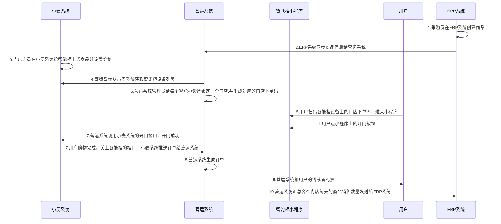

```mermaid
sequenceDiagram
participant B as 小麦系统
participant Y as 营运系统
participant X as 智能柜小程序
participant U as 用户
participant E as ERP系统

E ->> E: 1.采购员在ERP系统创建商品
E ->> Y: 2.ERP系统同步商品信息给营运系统
B ->> B: 3.门店店员在小麦系统给智能柜上架商品并设置价格
Y ->> B: 4.营运系统从小麦系统获取智能柜设备列表
Y ->> Y: 5.营运系统管理员给每个智能柜设备绑定一个门店,并生成对应的门店下单码
U ->> X: 5.用户扫码智能柜设备上的门店下单码，进入小程序
U ->> X: 6.用户点小程序上的开门按钮
Y ->> B: 7.营运系统调用小麦系统的开门接口，开门成功
B ->> Y: 7.用户购物完成，关上智能柜的柜门，小麦系统推送订单给营运系统
Y ->> Y: 8.营运系统生成订单
Y ->> U: 9.营运系统扣用户的钱或者礼票
Y ->> E: 10.营运系统汇总各个门店每天的商品销售数量发送给ERP系统

activate B
```

&#x20;
